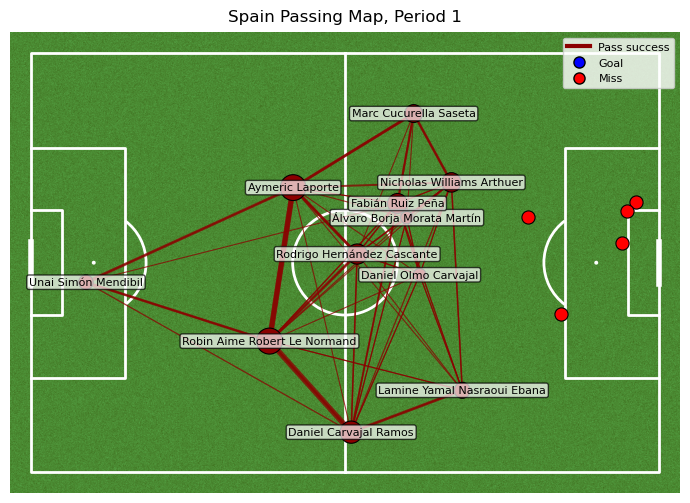
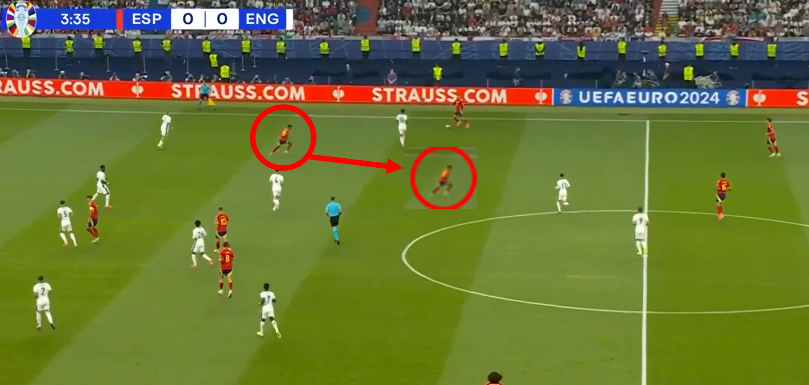
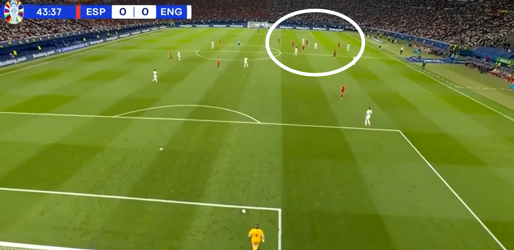

**Introduction**

In this paper, we discuss the EURO 2024 Final between England and Spain. Before analysing the match video, a brief discussion of the data and visualisation comes first. The data and visualisation review in advance aims to preview the match and raise questions based on the review.

The following video analysis shall focus on answering the raised questions.

**Preprocessing**


```python
#separate start and end locations from coordinates
events_df[['x', 'y']] = events_df['location'].apply(pd.Series)
events_df[['pass_end_x', 'pass_end_y']] = events_df['pass_end_location'].apply(pd.Series)
events_df[['carry_end_x', 'carry_end_y']] = events_df['carry_end_location'].apply(pd.Series)
```


```python
#separate the period
sel_period = 1

df = events_df[events_df['period'] == sel_period].copy()

#sort the DataFrame by timestamp in descending order
fp = df.sort_values(by='timestamp', ascending=True)

fp.head()
```

**Player & Team xG**


```python
# 페널티 제외
df1 = fp[fp['shot_type'] != 'Penalty'].copy()

# 선수별 xG 합계
p_xg = df1.groupby('player')['shot_statsbomb_xg'].sum().round(2)

# 선수별 슈팅 횟수 (결측이 아닌 shot_outcome만 카운트)
p_shots = df1[df1['shot_outcome'].notna()].groupby('player').size()

# 두 결과 합치기
p_stats = pd.concat([p_xg, p_shots], axis=1)
p_stats.columns = ['xG_sum', 'Shots']
p_stats = p_stats.sort_values('xG_sum', ascending=False)

# 팀별 xG
t_xg = df1.groupby('team')['shot_statsbomb_xg'].sum().round(2)

# 출력
print(f'Player & Team xG in {sel_period} Period')
print('-----------------------------------------------')
print(p_stats.head(12))
print('-----------------------------------------------')
print(t_xg)

```

    Player & Team xG in 1 Period
    -----------------------------------------------
                                  xG_sum  Shots
    player                                     
    Phil Foden                      0.18    1.0
    Robin Aime Robert Le Normand    0.12    1.0
    Álvaro Borja Morata Martín      0.08    1.0
    Nicholas Williams Arthuer       0.07    1.0
    Declan Rice                     0.05    1.0
    Fabián Ruiz Peña                0.05    1.0
    Harry Kane                      0.05    1.0
    Daniel Olmo Carvajal            0.03    1.0
    Luke Shaw                       0.00    NaN
    Unai Simón Mendibil             0.00    NaN
    Rodrigo Hernández Cascante      0.00    NaN
    Marc Guehi                      0.00    NaN
    -----------------------------------------------
    team
    England    0.28
    Spain      0.34
    Name: shot_statsbomb_xg, dtype: float64

**Duel Stats**

```python
#선수별 경합 성공률
df = fp.copy()

duel_won_cd = df[df['duel_outcome'].isin(['Won', 'Success In Play', 'Success Out']) | df['clearance_aerial_won'].isin([True])]
duel_won = duel_won_cd.groupby('player').size()
duel_lost_cd = df[df['duel_outcome'].isin(['Lost In Play', 'Lost Out']) | df['duel_type'].isin(['Aerial Lost'])]
duel_lost = duel_lost_cd.groupby('player').size()


# Combine duel_won and duel_lost into a single DataFrame indexed by player
duel_stat = pd.concat([duel_won.rename('Duel Won'), duel_lost.rename('Duel Lost')], axis=1).fillna(0)

duel_stat['Duel Success Rate'] = (duel_stat['Duel Won'] / (duel_stat['Duel Won'] + duel_stat['Duel Lost']) * 100).fillna(0).round(2)
duel_stat = duel_stat.sort_values(by='Duel Success Rate', ascending=False)

# To include team information and filter by team:
# First, get a player-to-team mapping from the original events dataframe
player_team_map = df[['player', 'team']].drop_duplicates(subset=['player']).set_index('player')['team']
# Merge this map with the duel_stat DataFrame
duel_stat = duel_stat.merge(player_team_map, left_index=True, right_index=True, how='left')


print(f'{sel_period} Period Duel Success Rate Per Player:')
print('-------------------------------------------------')
#print(duel_stat.head(30)) # Print top 30 overall

eng_duel_stat = duel_stat[duel_stat['team'] == 'England']
spa_duel_stat = duel_stat[duel_stat['team'] == 'Spain']

print('\nEngland Duel Stats:')
print('-------------------------------------------------')
print(eng_duel_stat)

print('\nSpain Duel Stats:')
print('-------------------------------------------------')
print(spa_duel_stat)
```

```
1 Period Duel Success Rate Per Player:
-------------------------------------------------

England Duel Stats:
-------------------------------------------------
                 Duel Won  Duel Lost  Duel Success Rate     team
player                                                          
Kyle Walker           2.0        0.0             100.00  England
Marc Guehi            1.0        0.0             100.00  England
John Stones           2.0        1.0              66.67  England
Jude Bellingham       3.0        4.0              42.86  England
Luke Shaw             1.0        2.0              33.33  England
Bukayo Saka           0.0        2.0               0.00  England
Harry Kane            0.0        4.0               0.00  England
Kobbie Mainoo         0.0        2.0               0.00  England
Phil Foden            0.0        1.0               0.00  England

Spain Duel Stats:
-------------------------------------------------
                              Duel Won  Duel Lost  Duel Success Rate   team
player                                                                     
Daniel Carvajal Ramos              4.0        1.0              80.00  Spain
Fabián Ruiz Peña                   1.0        1.0              50.00  Spain
Robin Aime Robert Le Normand       1.0        1.0              50.00  Spain
Aymeric Laporte                    1.0        2.0              33.33  Spain
Daniel Olmo Carvajal               1.0        2.0              33.33  Spain
Álvaro Borja Morata Martín         1.0        3.0              25.00  Spain
Rodrigo Hernández Cascante         0.0        1.0               0.00  Spain
```

**Duel Success Rates**

```python
duel_won_cd = df[df['duel_outcome'].isin(['Won', 'Success In Play', 'Success Out']) | df['clearance_aerial_won'].isin([True])]
duel_won = duel_won_cd.groupby('team').size()
duel_lost_cd = df[df['duel_outcome'].isin(['Lost In Play', 'Lost Out']) | df['duel_type'].isin(['Aerial Lost'])]
duel_lost = duel_lost_cd.groupby('team').size()


duel_stat = pd.concat([duel_won, duel_lost], axis=1).fillna(0)
duel_stat.columns = ['Duel Won', 'Duel Lost']

duel_stat['Duel Success Rate'] = (duel_stat['Duel Won'] / (duel_stat['Duel Won'] + duel_stat['Duel Lost']) * 100).fillna(0).round(2)
duel_stat = duel_stat.sort_values(by='Duel Success Rate', ascending=False)

print(f'{sel_period} Period Duel Success Rate Per Team')
print('-------------------------------------------------')
print(duel_stat.head(30))
```

```
1 Period Duel Success Rate Per Team
-------------------------------------------------
         Duel Won  Duel Lost  Duel Success Rate
team                                           
Spain           9         11               45.0
England         9         16               36.0
```

**Dribble Stats**

```python
df = fp.copy()
dribble_suc = df[df['dribble_outcome'] == 'Complete'].groupby('player').size()
dribble_fail = df[df['dribble_outcome'] == 'Incomplete'].groupby('player').size()
dribble_success_rate = (dribble_suc / (dribble_suc + dribble_fail) * 100).fillna(0).round(2)

dribble_stat = pd.concat([dribble_suc.rename('Dribble Success'), dribble_fail.rename('Dribble Fail'), dribble_success_rate.rename('Dribble Success Rate')], axis=1).fillna(0)

player_index = df[['player', 'team']].drop_duplicates(subset=['player']).set_index('player')['team']
dribble_stat = dribble_stat.merge(player_index, left_index=True, right_index=True, how='left')

dribble_stat  = dribble_stat.sort_values(by='Dribble Success Rate', ascending=False)

eng_dribble_stat = dribble_stat[dribble_stat['team'] == 'England']
spa_dribble_stat = dribble_stat[dribble_stat['team'] == 'Spain']

print(f'{sel_period} Period Dribble Success Rate by Player')
print('-------------------------------------------------------')
print(eng_dribble_stat.head(20))
print('-------------------------------------------------------')
print(spa_dribble_stat.head(20))
```

```
1 Period Dribble Success Rate by Player
-------------------------------------------------------
                 Dribble Success  Dribble Fail  Dribble Success Rate     team
player                                                                       
Declan Rice                  1.0           1.0                  50.0  England
Luke Shaw                    1.0           1.0                  50.0  England
Jude Bellingham              1.0           0.0                   0.0  England
Kobbie Mainoo                0.0           1.0                   0.0  England
Phil Foden                   0.0           1.0                   0.0  England
-------------------------------------------------------
                             Dribble Success  Dribble Fail  \
player                                                       
Nicholas Williams Arthuer                1.0           1.0   
Fabián Ruiz Peña                         1.0           0.0   
Lamine Yamal Nasraoui Ebana              0.0           1.0   
Álvaro Borja Morata Martín               0.0           1.0   

                             Dribble Success Rate   team  
player                                                    
Nicholas Williams Arthuer                    50.0  Spain  
Fabián Ruiz Peña                              0.0  Spain  
Lamine Yamal Nasraoui Ebana                   0.0  Spain  
Álvaro Borja Morata Martín                    0.0  Spain  
```

According to the xG from the first period, it seems to be more of a probing action. England showed 0.28, while Spain was higher at 0.34. However, it is a nuance, and as both teams’ expected goals are under 1, describing neither team created a potent goal-scoring chance. In terms of duel success, Spain had the advantage, winning 9 out of 20 (45%), while England won 9 out of 25 (36%). The duels include aerial and tackle duels. 

**England‘s Passing Map**


```python
TEAM_NAME = 'England'
TEAM_COLOR = 'white' #darkred or white

# 데이터 전처리
df = fp.copy()

# 좌표와 id만 숫자로, outcome들은 문자열 그대로 두기
num_cols = ['x','y','pass_end_x','pass_end_y','player_id','pass_recipient_id','period']
for c in num_cols:
    if c in df.columns:
        df[c] = pd.to_numeric(df[c], errors='coerce')

# 성공 패스만, StatsBomb에서는 pass_outcome이 NaN이면 성공
team_passes = (
    df[(df['team'] == TEAM_NAME)
       & (df['type'] == 'Pass')
       & (df['pass_outcome'].isna())]
    .dropna(subset=['x','y','pass_end_x','pass_end_y','player_id','pass_recipient_id'])
)

# 슛, 골 표기, shot_outcome으로 골 판단
team_shots = df[(df['team'] == TEAM_NAME) & (df['type'] == 'Shot')].copy()
team_shots['sx'] = team_shots['x']
team_shots['sy'] = team_shots['y']

id_to_name = (df[['player_id','player']].dropna()
              .drop_duplicates('player_id')
              .set_index('player_id')['player'].to_dict())

def make_network(team_df, min_edge_count=1):
    # 엣지, 패스 송수신 쌍과 횟수
    edges = (team_df
             .dropna(subset=['player_id','pass_recipient_id'])
             .groupby(['player_id','pass_recipient_id']).size()
             .reset_index(name='count'))
    edges = edges[edges['count'] >= min_edge_count].copy()

    # 노드, 평균 위치
    out_pos = (team_df.groupby('player_id')[['x','y']]
               .mean().rename(columns={'x':'x_out','y':'y_out'}))
    in_pos  = (team_df.groupby('pass_recipient_id')[['pass_end_x','pass_end_y']]
               .mean().rename(columns={'pass_end_x':'x_in','pass_end_y':'y_in'}))

    node_ids = pd.Index(out_pos.index).union(pd.Index(in_pos.index))
    nodes = (pd.DataFrame(index=node_ids)
             .join(out_pos, how='left')
             .join(in_pos, how='left'))
    nodes['x'] = nodes[['x_out','x_in']].mean(axis=1, skipna=True)
    nodes['y'] = nodes[['y_out','y_in']].mean(axis=1, skipna=True)

    sent = team_df.groupby('player_id').size().rename('sent')
    recv = team_df.groupby('pass_recipient_id').size().rename('received')
    nodes = nodes.join(sent, how='left').join(recv, how='left')
    nodes[['sent','received']] = nodes[['sent','received']].fillna(0)
    nodes['count'] = nodes['sent'] + nodes['received']

    nodes['name'] = nodes.index.map(lambda pid: id_to_name.get(pid, str(int(pid)) if pd.notna(pid) else 'NA'))
    nodes = nodes.dropna(subset=['x','y'])
    return nodes, edges

pitch = Pitch(pitch_type='statsbomb', pitch_color='grass', line_color='white')
fig, ax = pitch.draw(ncols=1, nrows=1, figsize=(7, 6.5))
fig.subplots_adjust(top=0.85)

period = 1
half_passes = team_passes[team_passes['period'] == period]
nodes, edges = make_network(half_passes, min_edge_count=1)

# 패스 라인
if not edges.empty and not nodes.empty:
    edges = edges.merge(nodes[['x','y']], left_on='player_id', right_index=True)
    edges = edges.merge(nodes[['x','y']], left_on='pass_recipient_id', right_index=True, suffixes=('_sx','_rx'))
    maxc = edges['count'].max()
    lw_scale = (4.0/maxc) if maxc and maxc > 0 else 1.5
    for _, r in edges.iterrows():
        pitch.lines(r['x_sx'], r['y_sx'], r['x_rx'], r['y_rx'],
                    ax=ax, lw=max(0.8, r['count']*lw_scale),
                    alpha=0.75, color=TEAM_COLOR, zorder=3)

# 노드
if not nodes.empty:
    maxn = nodes['count'].max()
    size_scale = (350/maxn) if maxn and maxn > 0 else 120
    pitch.scatter(nodes['x'], nodes['y'],
                  s=np.clip(nodes['count']*size_scale, 80, 800),
                  ax=ax, color=TEAM_COLOR, edgecolors='black', linewidth=0.8, zorder=4)
    for _, r in nodes.iterrows():
        ax.text(r['x'], r['y'], r['name'], fontsize=8, ha='center', va='center',
                color='black',
                bbox=dict(facecolor='white', alpha=0.7, boxstyle='round,pad=0.2'),
                zorder=5)

# 슛, 골 표기, shot_outcome으로 구분
hs = team_shots[team_shots['period'] == period]
if not hs.empty:
    g = hs[hs['shot_outcome'] == 'Goal']
    if not g.empty:
        pitch.scatter(g['sx'], g['sy'], s=90, ax=ax, color='blue',
                      edgecolors='black', linewidth=0.8, marker='o', zorder=6)
    m = hs[hs['shot_outcome'] != 'Goal']
    if not m.empty:
        pitch.scatter(m['sx'], m['sy'], s=90, ax=ax, color='red',
                      edgecolors='black', linewidth=0.8, marker='o', zorder=6)

# 범례와 제목
pass_proxy = Line2D([0],[0], color=TEAM_COLOR, lw=3, label='Pass success')
goal_proxy = Line2D([0],[0], marker='o', color='blue', lw=0, markersize=8,
                    markerfacecolor='blue', markeredgecolor='black', label='Goal')
miss_proxy = Line2D([0],[0], marker='o', color='red', lw=0, markersize=8,
                    markerfacecolor='red', markeredgecolor='black', label='Miss')
ax.legend(handles=[pass_proxy, goal_proxy, miss_proxy], loc='upper right', frameon=True, fontsize=8)
ax.set_title(f"{TEAM_NAME} Passing Map, Period {period}", fontsize=12, pad=8)

plt.show()
plt.savefig(f"England_Passing_Map_{period}.png",dpi=200, bbox_inches="tight")

```


**England‘s Passing Success Rates**

```python
Team = 'England'

passes_in_period = fp[fp['type'] == 'Pass'].copy()
successful_passes_count = passes_in_period['pass_outcome'].isna().sum()
total_passes_count = len(passes_in_period)

if total_passes_count > 0:
    tsr = ((successful_passes_count / total_passes_count) * 100).round(2)
else:
    tsr = None # Handle cases with no passes, e.g., set to None or np.nan

print('---------------------------------------------------------------------')
print(f'{Team} Pass Success Rate Per Team:', tsr, '%')
print('---------------------------------------------------------------------')

# Calculate pass success rate per player
player_passes_df = fp[(fp['type'] == 'Pass') & (fp['team'] == Team )].copy()

# Group by player and calculate successful passes and total passes
pass_stats_per_player = player_passes_df.groupby('player').agg(
    successful_passes=('pass_outcome', lambda x: x.isna().sum()),
    total_passes=('type', 'count')
)

# Calculate success rate per player
pass_stats_per_player['success_rate'] = ((pass_stats_per_player['successful_passes'] / pass_stats_per_player['total_passes']) * 100).round(2)

print(f'{Team} Pass Success Rate Per Player:')
print(pass_stats_per_player.sort_values(by='success_rate', ascending=False).head(20))
```

```
---------------------------------------------------------------------
England Pass Success Rate Per Team: 82.64 %
---------------------------------------------------------------------
England Pass Success Rate Per Player:
                 successful_passes  total_passes  success_rate
player                                                        
Marc Guehi                       8             8        100.00
Bukayo Saka                      8             9         88.89
John Stones                     15            18         83.33
Luke Shaw                        9            11         81.82
Kyle Walker                     16            20         80.00
Phil Foden                       8            10         80.00
Kobbie Mainoo                    9            12         75.00
Jordan Pickford                 13            19         68.42
Jude Bellingham                 10            15         66.67
Declan Rice                     11            18         61.11
Harry Kane                       5            10         50.00
```

**England’s Pass Failed Endpoints**

```python
TEAM_NAME = 'England'
DOT_COLOR = 'white'  # 팀 톤

# 데이터: 실패 패스(Outcome=0)의 종료 지점만 사용
df = fp.copy()
for c in ['pass_end_x','pass_end_y']:
    if c in df.columns:
        df[c] = pd.to_numeric(df[c], errors='coerce')

fail = df[(df['team']==TEAM_NAME) & (df['type']=='Pass') & (df['pass_outcome'].notna())]
fail = fail.dropna(subset=['pass_end_x','pass_end_y'])

# 그리기
pitch = Pitch(pitch_type='statsbomb', pitch_color='grass', line_color='white')
fig, ax = pitch.draw(ncols=1, nrows=1, figsize=(13, 6.5))
fig.subplots_adjust(top=0.83, wspace=0.18)

period = 1
dat = fail[fail['period'] == period]
if not dat.empty:
        # 원형 점: 투명도 누적 → 밀집도 직관적
        ax.scatter(dat['pass_end_x'], dat['pass_end_y'],
                   s=75, facecolor=DOT_COLOR, edgecolor='black',
                   linewidths=0.3, alpha=0.28, zorder=4)
    # 간단한 범례(원형 샘플)
dot_proxy = plt.Line2D([0],[0], marker='o', linestyle='',
                           markersize=8, markerfacecolor=DOT_COLOR,
                           markeredgecolor='black', label='Failed pass end')
ax.legend(handles=[dot_proxy], loc='upper right', fontsize=8, frameon=True)
ax.set_title(f"{TEAM_NAME} Failed Pass Endpoints (Period {period})", fontsize=11, pad=6)

plt.show()
plt.savefig(f"{TEAM_NAME} Failed Pass Endpoints {period}", dpi=200, bbox_inches="tight")
```


According to the Passing Map of England, the build-up starts with the Goalkeeper. It can be inferred that the team aimed to include the Goalkeeper in the build-up to gain numerical advantage, as Jordan Pickford made the second-highest number of passes in the team with 19. 

In terms of possession, which was kept on the right side, as shown by the size of the player's position circle. Regarding the left (Marc Guehi, Luke Shaw, and Jude Bellingham) and right (John Stones, Kyle Walker, Bukayo Saka) side players, the left side accounted for 34 of the team's 150 passes. In contrast, the right side made 47 passes, confirming the assumption based on visualisation. 

In addition, more manpower was invested, as two of the three midfielders' average positions leaned toward the right (Phil Foden and Kobbie Mainoo). Based on the up-to-date preview of the data and visualisation, it raised two questions. Was the overloaded right-side attack effective? Were the mid and left side attacks efficient? 

In the following preview of Spain’s first period, the raised questions shall be developed. 

**Spain’s Passing Map**


```python
TEAM_NAME = 'Spain'
TEAM_COLOR = 'darkred' #darked or white

# 데이터 전처리
df = fp.copy()

# 좌표와 id만 숫자로, outcome들은 문자열 그대로 두기
num_cols = ['x','y','pass_end_x','pass_end_y','player_id','pass_recipient_id','period']
for c in num_cols:
    if c in df.columns:
        df[c] = pd.to_numeric(df[c], errors='coerce')

# 성공 패스만, StatsBomb에서는 pass_outcome이 NaN이면 성공
team_passes = (
    df[(df['team'] == TEAM_NAME)
       & (df['type'] == 'Pass')
       & (df['pass_outcome'].isna())]
    .dropna(subset=['x','y','pass_end_x','pass_end_y','player_id','pass_recipient_id'])
)

# 슛, 골 표기, shot_outcome으로 골 판단
team_shots = df[(df['team'] == TEAM_NAME) & (df['type'] == 'Shot')].copy()
team_shots['sx'] = team_shots['x']
team_shots['sy'] = team_shots['y']

id_to_name = (df[['player_id','player']].dropna()
              .drop_duplicates('player_id')
              .set_index('player_id')['player'].to_dict())

def make_network(team_df, min_edge_count=1):
    # 엣지, 패스 송수신 쌍과 횟수
    edges = (team_df
             .dropna(subset=['player_id','pass_recipient_id'])
             .groupby(['player_id','pass_recipient_id']).size()
             .reset_index(name='count'))
    edges = edges[edges['count'] >= min_edge_count].copy()

    # 노드, 평균 위치
    out_pos = (team_df.groupby('player_id')[['x','y']]
               .mean().rename(columns={'x':'x_out','y':'y_out'}))
    in_pos  = (team_df.groupby('pass_recipient_id')[['pass_end_x','pass_end_y']]
               .mean().rename(columns={'pass_end_x':'x_in','pass_end_y':'y_in'}))

    node_ids = pd.Index(out_pos.index).union(pd.Index(in_pos.index))
    nodes = (pd.DataFrame(index=node_ids)
             .join(out_pos, how='left')
             .join(in_pos, how='left'))
    nodes['x'] = nodes[['x_out','x_in']].mean(axis=1, skipna=True)
    nodes['y'] = nodes[['y_out','y_in']].mean(axis=1, skipna=True)

    sent = team_df.groupby('player_id').size().rename('sent')
    recv = team_df.groupby('pass_recipient_id').size().rename('received')
    nodes = nodes.join(sent, how='left').join(recv, how='left')
    nodes[['sent','received']] = nodes[['sent','received']].fillna(0)
    nodes['count'] = nodes['sent'] + nodes['received']

    nodes['name'] = nodes.index.map(lambda pid: id_to_name.get(pid, str(int(pid)) if pd.notna(pid) else 'NA'))
    nodes = nodes.dropna(subset=['x','y'])
    return nodes, edges

pitch = Pitch(pitch_type='statsbomb', pitch_color='grass', line_color='white')
fig, ax = pitch.draw(ncols=1, nrows=1, figsize=(7, 6.5))
fig.subplots_adjust(top=0.85)

period = 1
half_passes = team_passes[team_passes['period'] == period]
nodes, edges = make_network(half_passes, min_edge_count=1)

# 패스 라인
if not edges.empty and not nodes.empty:
    edges = edges.merge(nodes[['x','y']], left_on='player_id', right_index=True)
    edges = edges.merge(nodes[['x','y']], left_on='pass_recipient_id', right_index=True, suffixes=('_sx','_rx'))
    maxc = edges['count'].max()
    lw_scale = (4.0/maxc) if maxc and maxc > 0 else 1.5
    for _, r in edges.iterrows():
        pitch.lines(r['x_sx'], r['y_sx'], r['x_rx'], r['y_rx'],
                    ax=ax, lw=max(0.8, r['count']*lw_scale),
                    alpha=0.75, color=TEAM_COLOR, zorder=3)

# 노드
if not nodes.empty:
    maxn = nodes['count'].max()
    size_scale = (350/maxn) if maxn and maxn > 0 else 120
    pitch.scatter(nodes['x'], nodes['y'],
                  s=np.clip(nodes['count']*size_scale, 80, 800),
                  ax=ax, color=TEAM_COLOR, edgecolors='black', linewidth=0.8, zorder=4)
    for _, r in nodes.iterrows():
        ax.text(r['x'], r['y'], r['name'], fontsize=8, ha='center', va='center',
                color='black',
                bbox=dict(facecolor='white', alpha=0.7, boxstyle='round,pad=0.2'),
                zorder=5)

# 슛, 골 표기, shot_outcome으로 구분
hs = team_shots[team_shots['period'] == period]
if not hs.empty:
    g = hs[hs['shot_outcome'] == 'Goal']
    if not g.empty:
        pitch.scatter(g['sx'], g['sy'], s=90, ax=ax, color='blue',
                      edgecolors='black', linewidth=0.8, marker='o', zorder=6)
    m = hs[hs['shot_outcome'] != 'Goal']
    if not m.empty:
        pitch.scatter(m['sx'], m['sy'], s=90, ax=ax, color='red',
                      edgecolors='black', linewidth=0.8, marker='o', zorder=6)

# 범례와 제목
pass_proxy = Line2D([0],[0], color=TEAM_COLOR, lw=3, label='Pass success')
goal_proxy = Line2D([0],[0], marker='o', color='blue', lw=0, markersize=8,
                    markerfacecolor='blue', markeredgecolor='black', label='Goal')
miss_proxy = Line2D([0],[0], marker='o', color='red', lw=0, markersize=8,
                    markerfacecolor='red', markeredgecolor='black', label='Miss')
ax.legend(handles=[pass_proxy, goal_proxy, miss_proxy], loc='upper right', frameon=True, fontsize=8)
ax.set_title(f"{TEAM_NAME} Passing Map, Period {period}", fontsize=12, pad=8)

plt.show()
plt.savefig(f"Spain Passing Map {period}.png", dpi=200, bbox_inches="tight")

```



**Spain‘s Passing Success Rates**


```python
Team = 'Spain'

passes_in_period = fp[fp['type'] == 'Pass'].copy()
successful_passes_count = passes_in_period['pass_outcome'].isna().sum()
total_passes_count = len(passes_in_period)

if total_passes_count > 0:
    tsr = ((successful_passes_count / total_passes_count) * 100).round(2)
else:
    tsr = None # Handle cases with no passes, e.g., set to None or np.nan

print('---------------------------------------------------------------------')
print(f'{Team} Pass Success Rate Per Team:', tsr, '%')
print('---------------------------------------------------------------------')

# Calculate pass success rate per player
player_passes_df = fp[(fp['type'] == 'Pass') & (fp['team'] == Team )].copy()

# Group by player and calculate successful passes and total passes
pass_stats_per_player = player_passes_df.groupby('player').agg(
    successful_passes=('pass_outcome', lambda x: x.isna().sum()),
    total_passes=('type', 'count')
)

# Calculate success rate per player
pass_stats_per_player['success_rate'] = ((pass_stats_per_player['successful_passes'] / pass_stats_per_player['total_passes']) * 100).round(2)

print(f'{Team} Pass Success Rate Per Player:')
print(pass_stats_per_player.sort_values(by='success_rate', ascending=False).head(20))
```

    ---------------------------------------------------------------------
    Spain Pass Success Rate Per Team: 82.64 %
    ---------------------------------------------------------------------
    Spain Pass Success Rate Per Player:
                                  successful_passes  total_passes  success_rate
    player                                                                     
    Robin Aime Robert Le Normand                 48            49         97.96
    Marc Cucurella Saseta                        25            26         96.15
    Aymeric Laporte                              48            50         96.00
    Unai Simón Mendibil                          17            18         94.44
    Rodrigo Hernández Cascante                   29            32         90.62
    Daniel Carvajal Ramos                        37            43         86.05
    Fabián Ruiz Peña                             24            30         80.00
    Nicholas Williams Arthuer                    24            31         77.42
    Daniel Olmo Carvajal                         10            13         76.92
    Lamine Yamal Nasraoui Ebana                  13            22         59.09
    Álvaro Borja Morata Martín                    8            14         57.14

**Spain’s Pass Failed Endpoints**


```python
TEAM_NAME = 'Spain'
DOT_COLOR = 'darkred'  # 팀 톤

# 데이터: 실패 패스(Outcome=0)의 종료 지점만 사용
df = fp.copy()
for c in ['pass_end_x','pass_end_y']:
    if c in df.columns:
        df[c] = pd.to_numeric(df[c], errors='coerce')

fail = df[(df['team']==TEAM_NAME) & (df['type']=='Pass') & (df['pass_outcome'].notna())]
fail = fail.dropna(subset=['pass_end_x','pass_end_y'])

# 그리기
pitch = Pitch(pitch_type='statsbomb', pitch_color='grass', line_color='white')
fig, ax = pitch.draw(ncols=1, nrows=1, figsize=(13, 6.5))
fig.subplots_adjust(top=0.83, wspace=0.18)

period = 1
dat = fail[fail['period'] == period]
if not dat.empty:
        # 원형 점: 투명도 누적 → 밀집도 직관적
        ax.scatter(dat['pass_end_x'], dat['pass_end_y'],
                   s=75, facecolor=DOT_COLOR, edgecolor='black',
                   linewidths=0.3, alpha=0.28, zorder=4)
    # 간단한 범례(원형 샘플)
dot_proxy = plt.Line2D([0],[0], marker='o', linestyle='',
                           markersize=8, markerfacecolor=DOT_COLOR,
                           markeredgecolor='black', label='Failed pass end')
ax.legend(handles=[dot_proxy], loc='upper right', fontsize=8, frameon=True)
ax.set_title(f"{TEAM_NAME} Failed Pass Endpoints (Period {period})", fontsize=11, pad=6)

plt.show()
plt.savefig(f"{TEAM_NAME} Failed Pass Endpoints {period}", dpi=200, bbox_inches="tight")
```


According to the Spain Passing Map, the build-up mostly starts from the two centre-backs. England used to let both full-backs in the front, almost like the wingers. Therefore, it was necessary to involve the goalkeeper in the build-up so that the two centre-backs were not solely exposed to pressure. On the other hand, Spain’s goalkeeper was not actively involved in the build-up as Unai Simon Mendibil only progressed 18 passes, while the two centre-backs' average pass total is 49.5 (Figure 9). Furthermore, Spain adopted an inverted full-back system. Putting the left fullback in the front while the right fullback stays behind to take on the role of the third centre-back. The midfielders were also leaning to the left. Consequently, it could be inferred that Spain has overloaded midfielders toward the left side to go aggressively, which corresponds with the left fullback’s progress. Another reason for midfielders’ leaning toward the left is one way to counter England’s attacking strategy. In the visualisation, all teams progress left to right to simplify it for viewers. 

In reality, England progresses toward the right and Spain toward the left. As previously mentioned, England chose to take advantage of numbers on the right side of the attack, forcing both teams to maximise players on the same side. Spain was able to isolate the right side thanks to their decent winger, Lamine Yamal. 

To sum up, England and Spain both chose one side as their primary attack route, which turns out to be the same space. Therefore, it is expected to be the most significant battleground. Another viewpoint is that the isolated side attack was effective. Referring to the failed pass endpoints and pass metrics, both isolated wingers had around 60 per cent of pass success rate, which corresponds with the pass failed points being more focused on each team’s isolated sides. 

In conclusion, the main question to be answered by the video analysis is: First, how did the particular team win the overloaded side? Second, which isolated sides' attacks were more effective, and how? 

Answering the two questions shall bring us closer to the answers to all the doubts related to low xG and shot attempts of both teams. 

**Video Analysis**


In the first half, England approached the game in a cautious manner. Rather than pressing aggressively to win the ball high up the pitch, they focused on man-marking central players, as shown in the image above, effectively blocking the central areas and deliberately guiding the opponent toward the wide areas.


In contrast, during the early phases of Spain’s build-up, Rodri initially attempted to support circulation by dropping into central areas while the back four spread wide to provide width. However, as mentioned earlier, England disrupted this structure, with Harry Kane and Phil Foden actively applying man-oriented pressure to disrupt Spain’s build-up.

In the following sequence, Rodri’s positioning in response to this pressure is particularly impressive. To shake off Foden’s man-marking, Rodri chose to drop all the way into the centre-back line and directly involve himself in the build-up. By doing so, as illustrated in the scene below, Spain was able to create temporary 3v2 situations in central areas, making it difficult for England to press effectively and, as a result, naturally increasing their share of possession.


In this sequence, Rodri drops into the space vacated by the right full-back, Carvajal, who has moved higher up the pitch, positioning himself almost like the right-sided centre-back in a back three. This movement effectively exploits England’s heavy investment in protecting the central areas.

With both of England’s markers drawn into the middle, Rodri can carry the ball forward toward Carvajal’s side, momentarily creating a 2v1 situation against the opposing winger, Bellingham. This allows Spain to progress into the opposition half with greater ease, and similar patterns can be observed repeatedly throughout the first half.



Another example can be seen in the scene above. England’s left winger, Bellingham, positions himself closer to the central area to block passing lanes into the half-spaces, staying tight to Foden and Kane. As a result, Spain’s right full-back, Carvajal, can receive the ball more freely, with Bellingham then forced to track across.

At this moment, the right winger, Yamal, drops toward the ball, instantly creating a 2v1 situation against Bellingham. This movement not only relieves pressure but also allows Spain to maintain possession without disruption.


The following sequence presents a similar pattern. Rather than positioning himself between two midfielders, Rodri drops deeper and operates almost as the central defender in a back three. This makes it difficult for the opponent to apply pressure, while the two original centre-backs shift wider to the left and right, encouraging numerical superiority on the flanks.


As a result, in the following sequence, Laporte can carry the ball forward into the left-sided space without being put under pressure. Rodri’s involvement in the build-up is particularly encouraging here, as it allows Laporte to circulate the ball to Cucurella quickly. At the same time, the left winger, Nico Williams, drops early to create a momentary 2v1 situation against the marked Saka.


In this scene as well, he moves directly into the left-sided channel, occupying Cucurella’s original position. This allows Cucurella to advance one line higher while simultaneously providing the centre-back with an additional passing option.

Through these repeated movements, Spain was able to progress the ball into the opposition half with relative ease throughout the first half.

In contrast, England attempted to operate strictly within their established system. As previously described, they focused on shutting down the central areas and, as shown in the two consecutive sequences below, guided the opponent toward the flanks before applying double-team pressure to isolate the ball carrier.




In addition, rather than building up through structured possession, England frequently opted for goal kicks aimed toward the right side of the opposition half, where several players were positioned beyond the halfway line to contest second balls and quickly regain possession high up the pitch. This reliance on long balls also helps explain why Jordan Pickford’s pass completion rate, previously noted at 68.42 per cent, was relatively low.


In this sequence, when England chose to build up from the back rather than from a goal kick, the goalkeeper stepped higher to form a three-man build-up structure, similar to Spain’s approach. However, a key difference lies in the much wider spacing between the players.

In response, Spain adopted a markedly tighter pressing approach compared to England. The striker applied pressure to the ball carrier while blocking passing lanes, before forcing play toward one flank and then engaging in man-oriented pressing to attempt ball recoveries.


In the subsequent sequence shown above, under intense pressure, Guehi’s pass finds Luke Shaw dropping deeper to receive the ball. However, once Shaw is in possession, all of his teammates are tightly marked, leaving him with no viable passing options and ultimately forcing England to concede possession. 


This scene follows a similar pattern. While positioned high up the pitch, once the centre-back comes under pressure, the winger, Bellingham, is forced to drop deep in a rushed attempt to offer support.

Watching the first half as a whole, while Spain’s pressing structure was certainly effective, it becomes clear that England itself contributed to sustaining a difficult game state. They stubbornly adhered to their pre-planned rules and system, yet the system itself lacked sufficient completeness, a limitation clearly exposed throughout the first half.

At a broader level, several structural issues stand out: excessively wide spacing on the flanks during build-up, the use of goalkeeper long kicks toward the right side despite the personnel being ill-suited for aerial duels, and an underdeveloped build-up framework overall. To begin with, as shown in England’s Passing Map, Luke Shaw’s average position on the left is extremely high, almost identical to that of the winger, Jude Bellingham. This leads to overly stretched spacing during build-up, making England highly vulnerable to pressure. With both Shaw and Bellingham positioned high as build-up begins, England’s left side naturally becomes numerically underloaded.

Although Shaw or Bellingham eventually drops to receive the ball, the delay allows the opposition defence to settle into position and apply tight man marking. As a result, England’s players are unable to turn and face forward, often forced to play backward passes or to shield the ball with their backs to the goal, creating an apparent dilemma.

In other words, some players’ positioning appears to be oriented toward long-ball situations, while the goalkeeper and centre-backs opt for short build-up, creating repeated moments of tactical dissonance. This is ultimately the outcome of an unclear tactical direction.

Secondly, although England frequently used long goal kicks with the intention of crowding the right side and winning duels to secure possession high up the pitch, the physical profile of the players in that zone was not suited to such contests. The primary targets on England’s right were Bukayo Saka, Kobbie Mainoo, Phil Foden, and Kane. Spain clearly recognised this and responded by positioning two centre-backs, a full-back, and three midfielders in the same area. Excluding Kane, all of England’s players involved are under 180 centimetres, meaning they were required to win aerial and physical duels against Spanish centre-backs in the high 180s to low 190s range, as well as tall midfielders. As previously shown, the duel success rates of the four England players involved were extremely poor. When unsuitable player profiles are paired with a predictable and straightforward tactical idea, the opponent can easily respond by committing numbers.

To summarise, England were unable to control the first half, constrained by passive pressing and a rigid tactical framework. In contrast, Spain responded precisely to England’s intentions, demonstrating flexibility and repeatedly allocating additional players to the flanks that England attempted to exploit. This allowed Spain to consistently generate momentary numerical advantages, maintaining superiority in possession and attacking initiative throughout the first half.

Addressing the two questions raised from the data, Spain, as explained, invested numbers on the flanks with Rodri’s positioning as the reference point, successfully securing numerical superiority. England, meanwhile, also added numbers by shifting two of their three midfielders toward the right, but this failed to produce any meaningful outcome.

As for whether attacks on the opposite, less invested side were practical, neither team consistently attempted to draw the opponent toward one flank and then exploit the far side through large switches to create isolated 1v1 situations for the wingers. Instead, both sides primarily relied on gradual circulation through centre-backs and midfielders, incrementally increasing numbers to break down the opposition structure.

In conclusion, the first half was a clear tactical victory for Spain. With that established, the focus now turns to what changes England introduced in the second half to turn the match around. 

Shall continue in the next part.
